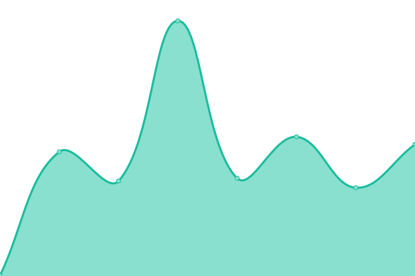
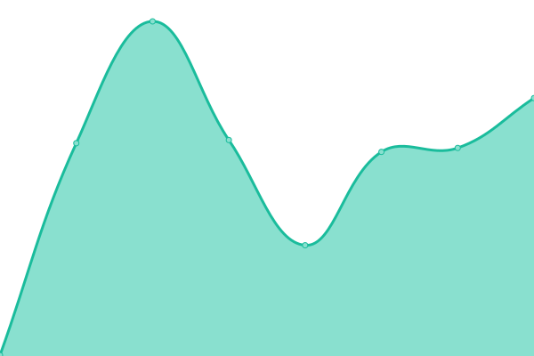
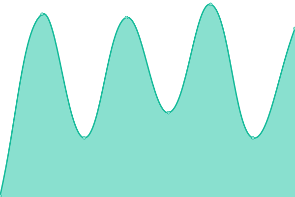

# [📈 Live Status](https://demo.upptime.js.org): <!--live status--> **🟧 Partial outage**

This repository contains the open-source uptime monitor and status page for [Yun](https://demo.upptime.js.org), powered by [Upptime](https://github.com/upptime/upptime).

With [Upptime](https://upptime.js.org), you can get your own unlimited and free uptime monitor and status page, powered entirely by a GitHub repository. We use [Issues](https://github.com/tgcbks76482/upptime1/issues) as incident reports, [Actions](https://github.com/tgcbks76482/upptime1/actions) as uptime monitors, and [Pages](https://demo.upptime.js.org) for the status page.

<!--start: status pages-->
<!-- This summary is generated by Upptime (https://github.com/upptime/upptime) -->
<!-- Do not edit this manually, your changes will be overwritten -->
<!-- prettier-ignore -->
| URL | Status | History | Response Time | Uptime |
| --- | ------ | ------- | ------------- | ------ |
|  [Youtube](https://www.youtube.com/) | 🟩 Up | [youtube.yml](https://github.com/tgcbks76482/upptime1/commits/HEAD/history/youtube.yml) | 

 296ms
     
 | 

<a href="https://demo.upptime.js.org/history/youtube">100.00%</a>
    

|  [Dcard](https://www.dcard.tw/f) | 🟥 Down | [dcard.yml](https://github.com/tgcbks76482/upptime1/commits/HEAD/history/dcard.yml) | 

 252ms
     
 | 

<a href="https://demo.upptime.js.org/history/dcard">100.00%</a>
    

|  [SHOPEE](https://shopee.tw/) | 🟩 Up | [shopee.yml](https://github.com/tgcbks76482/upptime1/commits/HEAD/history/shopee.yml) | 

 1502ms
     
 | 

<a href="https://demo.upptime.js.org/history/shopee">100.00%</a>
    

|  [Twitch](https://www.twitch.tv/) | 🟩 Up | [twitch.yml](https://github.com/tgcbks76482/upptime1/commits/HEAD/history/twitch.yml) | 

 136ms
     
 | 

<a href="https://demo.upptime.js.org/history/twitch">100.00%</a>
    

|  [NCU](https://www.ncu.edu.tw/tw/) | 🟩 Up | [ncu.yml](https://github.com/tgcbks76482/upptime1/commits/HEAD/history/ncu.yml) | 

 2533ms
     
 | 

<a href="https://demo.upptime.js.org/history/ncu">100.00%</a>
    

|  [failed](https://fewfwee/) | 🟥 Down | [failed.yml](https://github.com/tgcbks76482/upptime1/commits/HEAD/history/failed.yml) | 

 0ms
     
 | 

<a href="https://demo.upptime.js.org/history/failed">100.00%</a>
    

<!--end: status pages-->

[**Visit our status website →**](https://demo.upptime.js.org)

## 📄 License

- Powered by: [Upptime](https://github.com/upptime/upptime)
- Code: [MIT](./LICENSE) © [Yun](https://demo.upptime.js.org)
- Data in the `./history` directory: [Open Database License](https://opendatacommons.org/licenses/odbl/1-0/)
